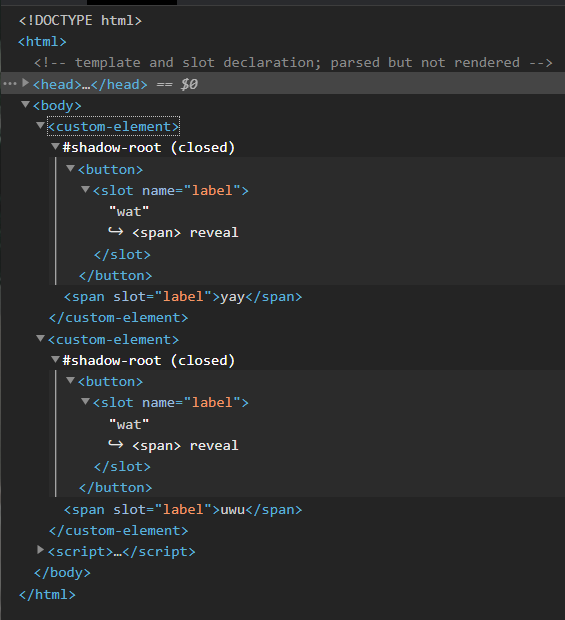

# Web Components Cheatsheet

## Basic customized built-in elements

```html
<!DOCTYPE html>
<html>
  <!-- declaration: `is` on existing tags -->
  <button is="custom-button"></button>
  <script>
    "use strict";
    customElements.define(
      "custom-button", // mandatory: '-' in name
      // extends specific element class
      class extends HTMLButtonElement {
        constructor() {
          super(); // mandatory: call super first
          this.append("yay"); // `this` refers to the element root
        }
      },
      // mandatory parameter for `customElements.define` method
      { extends: "button" }
    );
  </script>
</html>
```

rendered dom:

```html
<button is="custom-button">yay</button>
```

## Attributes with autonomous custom elements

```html
<!DOCTYPE html>
<html>
  <!-- declaration: new custom tag -->
  <custom-element data-owner="yukirock"></custom-element>
  <script>
    "use strict";
    customElements.define(
      "custom-element", // mandatory: '-' in name
      // extends base class
      class extends HTMLElement {
        get owner() {
          return this.hasAttribute("data-owner") ? this.getAttribute("data-owner") : "nobody";
        }
        constructor() {
          super(); // mandatory: call super first
          this.append(`yay ${this.owner}`);
        }
      }
      // no extends object
    );
  </script>
</html>
```

rendered dom:

```html
<custom-element data-owner="yukirock">yay yukirock</custom-element>
```

## Basic shadow dom and template

Seems they must work together.

```html
<!DOCTYPE html>
<html>
  <!-- template and slot declaration; parsed but not rendered -->
  <template id="myButton">
    <button>
      <slot name="label">wat</slot>
    </button>
  </template>

  <!-- element declaration with slot fulfilling -->
  <custom-element><span slot="label">yay</span></custom-element>
  <custom-element><span slot="label">uwu</span></custom-element>

  <script>
    "use strict";
    customElements.define(
      "custom-element", // mandatory: '-' in name
      class extends HTMLElement {
        constructor() {
          super(); // mandatory: call super first
          const myButtonTemplate = document.getElementById("myButton");
          const shadowRoot = this.attachShadow({ mode: "closed" }); // creates shadow root
          shadowRoot.appendChild(myButtonTemplate.content.cloneNode(true)); // 'initialize' and inject template
        }
      }
    );
  </script>
</html>
```

rendered dom:


