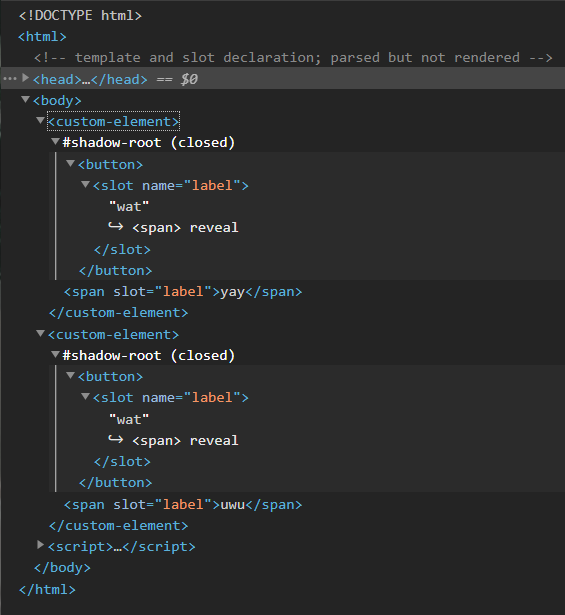

# Web Components Cheatsheet

TOC

## Basic customized built-in elements

examples/1-basic-built-in.html

rendered dom:

```html
<button is="custom-button">yay</button>
```

- [The HTML DOM API](https://developer.mozilla.org/en-US/docs/Web/API/HTML_DOM_API)
- [ES5 Classes](https://developer.mozilla.org/en-US/docs/Web/JavaScript/Reference/Classes)
- [`CustomElementRegistry.define()`](https://developer.mozilla.org/en-US/docs/Web/API/CustomElementRegistry/define)

## Attributes with autonomous custom elements

examples/2-attributes-autonomous.html

rendered dom:

```html
<custom-element data-owner="yukirock">yay yukirock</custom-element>
```

## Basic shadow dom and template

Seems they must work together.

examples/3-shadow-dom-template.html

rendered dom:



## Shadow dom and style

examples/4-shadow-dom-style.html

## References

- [MDN](https://developer.mozilla.org/en-US/docs/Web/Web_Components)
- [JS INFO](https://javascript.info/web-components)
